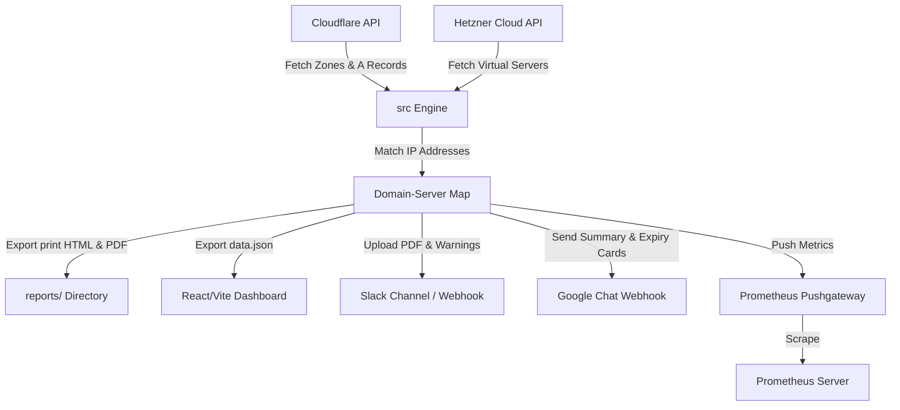

# CloudMesh Project Specification

## 1. System Overview
CloudMesh is an infrastructure auditing and monitoring utility that maps Cloudflare DNS domains and subdomains (specifically A records) to corresponding Hetzner Cloud virtual servers by resolving and matching their IP addresses. It helps detect orphaned subdomains (unmatched A records) and monitors cloud costs and resource status across multiple projects.

## 2. Directory Structure
```
├── .github/                  # CI/CD Workflows
├── clinerules/               # Agent rules and configurations
├── docs/                     # Comprehensive documentation
│   ├── CONFIGURATION.md      # Configuration options
│   ├── DEPLOYMENT.md         # Deployment guides
│   ├── ROADMAP.md            # Future feature enhancements
│   ├── SECURITY.md           # Security policies and guidelines
│   └── TROUBLESHOOTING.md    # Known issues and resolution steps
├── frontend/                 # React/Vite TypeScript frontend dashboard
├── reports/                  # Generated HTML, PDF, and JSON outputs (gitignored)
├── src/                      # Modular Python package engine
│   ├── api/                  # API integration modules (Cloudflare/Hetzner)
│   ├── core/                 # Matcher and calculation logic
│   ├── notifications/        # Slack and Google Chat messaging clients
│   ├── reports/              # Print HTML and JSON report generator
│   ├── config.py             # Configuration loader and validator
│   ├── metrics.py            # Prometheus metrics setup
│   └── main.py               # Orchestrator flow
├── docker-compose.yml        # Docker composition for monitoring stack (Prometheus/Pushgateway)
├── package.json              # Frontend linter, prettier, and release scripts
├── prometheus.yml            # Scraping target configuration
├── script.py                 # Core Python engine entrypoint (thin wrapper)
└── PROJECT.md                # Architectural design and conventions (this file)
```

## 3. Domain Model & Data Flow
The core entities and data-flow model are structured as follows:



### Key Entities
- **Zone (Domain):** Top-level domain registered in Cloudflare.
- **DNS Record (A Record):** Subdomain mapping to an IPv4 address.
- **Hetzner Server:** Virtual machine or load balancer instance with a public IPv4 address, project name, server type, pricing (dynamically resolved location-aware), traffic statistics, hardware specs (cores, memory, disk, datacenter), OS image description, and delete/lock flags.
- **Mapping Item:** Resolved association containing subdomain, IP, target project, server name, status, creation date, type, cost, traffic, and labels.

## 4. Multi-Page Dashboard Architecture
The React dashboard supports 5 main pages/tabs:
- **Overview & Topology:** General metrics, advanced search/filters, SVG-based infrastructure mapping graph, and tabular audits.
- **Cost & Billing:** Visual project and location spend breakdowns, unmapped resource alerts, stale resource optimization suggestions, and billing list.
- **Domains & WHOIS:** Domain zone registration expiry tracking, timeline countdowns, and advanced registry health.
- **Compute Resources:** Hardware resource aggregates (cores, memory, storage) and operating system distribution map.
- **Security & Port Audit:** SSH/RDP public exposure detection alerts, open service scanners, and historical port status logs.

## 5. Configuration & Conventions
- **Credentials:** Shared via `.env` file or environment variables (`CLOUDFLARE_TOKEN`, `HETZNER_TOKEN_x`, `PUSHGATEWAY_URL`, `SLACK_BOT_TOKEN`, `SLACK_CHANNEL_ID`, `GOOGLE_CHAT_WEBHOOK_URL`).
- **Feature Flags:** Toggled via `ENABLE_SLACK_NOTIFICATIONS`, `ENABLE_GOOGLE_CHAT_NOTIFICATIONS`, and `GENERATE_REPORTS`.
- **Naming Conventions:** Python variables and functions follow `snake_case`. React components follow standard `PascalCase` and custom hooks follow `camelCase`.

